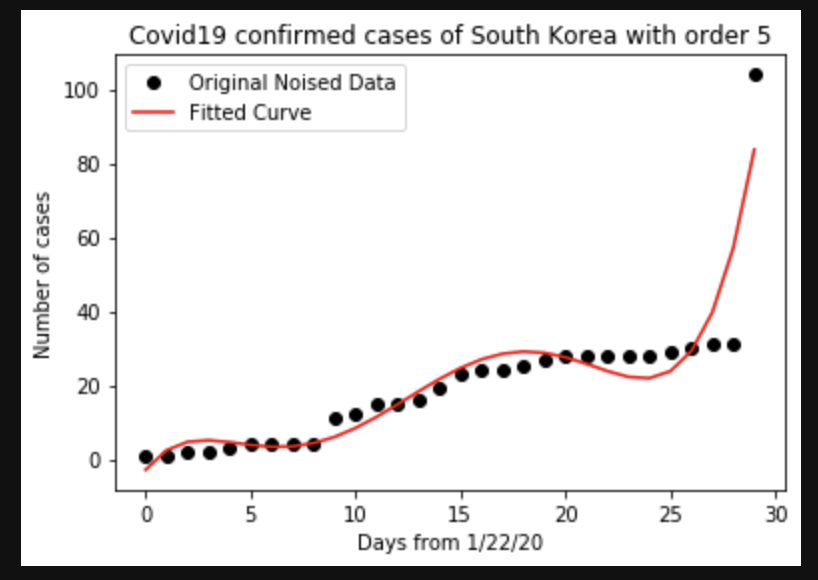

## COVID19 confirmed cases with polynomial fitting

### Repository
[Github](https://github.com/phamminhquan/covid19)

### Description
With data taken from [Kaggle](https://www.kaggle.com/sudalairajkumar/novel-corona-virus-2019-dataset), I made a Jupyter Lab (or Jupyter Notebook) polynimal cureve fitting tool. The tool takes in filter values such as:

* Country, e.g US
* Order of polynomial, e.g. 4

The algorithm will perfrom curve fitting (with mean-squared-error minimization) using polynomial basis functions. The notebook will plot both the true data and the fitted curve on the same plot for easy inspection.

### Dependencies

* numpy
* matplotlib
* ipywidgets
* IPython.display
* csv 

### Usage

* Run all `covid19_curvefitting.ipynb`
* Select filter requirements from widgets
* Run the last cell

### Example
Here is an example of what the plot looks like:

### TODO
Explore the data some more, maybe try exponential basis function and compare 
