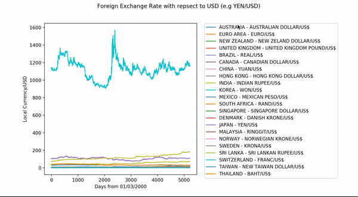

# Plot of Foreign Currency Exchange Rates with respect to USD (2000-2019)

# Repository
[Github](https://github.com/phamminhquan/foreign_exchange_rate)

## Description
With data taken from [Kaggle](https://www.kaggle.com/brunotly/foreign-exchange-rates-per-dollar-20002019), I made a python program to plot the exchange rate for some of the popular currencies.

## Dependencies

* pandas
* numpy
* matplotlib

## Usage

* Run all `foreign_exchange_rate.py`, e.g `python3 foreign_exchange_rate.py`
* User can toggle which currency showing on the plot by clicking the legend of that specific currency

## Example
Here is an example of what the plot looks like:

## TODO
Fix x-axis (DONE)
