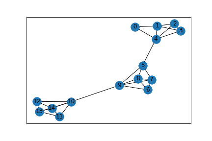

# Simulate Communication Networks with NS-3

## Repository
[Github](https://github.com/phamminhquan/ns3)

## Description
This project is a tool to simulate any given network topology with [NS-3](https://www.nsnam.org). [NS-3](https://www.nsnam.org) is free software, often used in industry to simulate networks with different topologies, traffic, etc. This project includes a Python Jupyter Notebook to construct a network graph. A config file is generated based on the network graph. NS-3 C++ file parses the config file, generated the given network, simulate TCP traffic, and outputs throughput for each node to terminal.

## Dependencies

* numpy
* matplotlib
* networkx
* ns3

## Usage

* Use `./python/gen.ipynb` notebook to generate config files
* Config files (`.cfg`) are saved in `./config_files/` folder
* Pictures of generated network are saved in `./graphs/` folder
* Copy or move the `main.cc` to `scratch` directory of ns-3
* Change `config_filepath` in `main.cc` so ns-3 can reference the config file appropriately
* Run ns-3 by `./waf --run scratch/main`

## Hyperparamters
Here are the hyperparameters in `main.cc`:

* `config_filepath`: path to config file with respect to current directory
* `packetSize`: TCP packet size in bytes
* `channel_cap`: point-to-point channel capacity in Mbps, often depends on physical property of channel
* `channel_delay`: point-to-point channel delay, often depends on physical distance between nodes
* `bernoulli_param`: probability of traffic given any pair of nodes
* `sim_start`: time in seconds when all applications starts
* `sim_duration`: time in seconds when all applications stops
* `stop_time`: time in seconds when simulation stops

## Example
Here is an example of a topology that is generated by the current code in python notebook:



Here is what `main.cc` outputs to terminal with given hyperparameters:

```
=============== HYPERPARAMTERS ===============

Setting Hyperparameters
Packet size: 256 bytes
Channel capacity: 10Mbps
Channel delay: 1ms
Traffic probability: 0.5
Simulation start time (respect to 0s): 1s
Simulation duration (repsect to 0s): 2s
Simulation stop time (respect to 0s): 5s

=============== PARSE CONFIG FILE ==============

Get file from path: ../python/config_files/line3.cfg
Number of nodes: 15
Number of edges: 30
Connection: 0-1
Connection: 0-2
Connection: 0-3
Connection: 0-4
Connection: 1-2
Connection: 1-3
Connection: 1-4
Connection: 2-3
Connection: 2-4
Connection: 3-4
Connection: 4-5
Connection: 5-6
Connection: 5-7
Connection: 5-9
Connection: 6-7
Connection: 6-8
Connection: 6-9
Connection: 7-8
Connection: 7-9
Connection: 8-9
Connection: 9-10
Connection: 10-12
Connection: 10-13
Connection: 10-14
Connection: 11-12
Connection: 11-13
Connection: 11-14
Connection: 12-13
Connection: 12-14
Connection: 13-14

=============== SETUP ===============

Initialize traffic probability as random device/generator
Create nodes
Create link
Install internet stack
Create IPV4 interfaces
Create interface: 0-1
Create interface: 0-2
Create interface: 0-3
Create interface: 0-4
Create interface: 1-2
Create interface: 1-3
Create interface: 1-4
Create interface: 2-3
Create interface: 2-4
Create interface: 3-4
Create interface: 4-5
Create interface: 5-6
Create interface: 5-7
Create interface: 5-9
Create interface: 6-7
Create interface: 6-8
Create interface: 6-9
Create interface: 7-8
Create interface: 7-9
Create interface: 8-9
Create interface: 9-10
Create interface: 10-12
Create interface: 10-13
Create interface: 10-14
Create interface: 11-12
Create interface: 11-13
Create interface: 11-14
Create interface: 12-13
Create interface: 12-14
Create interface: 13-14
Initialize routing table
Initialize source and sink helpers
Initialize traffic helper
Create traffic
Create source app at sink node: 0
Bernoulli Success
Install source app on source node: 1
Bernoulli Success
Install source app on source node: 4
Bernoulli Success
Install source app on source node: 5
Bernoulli Success
Install source app on source node: 6
Bernoulli Success
Install source app on source node: 7
Bernoulli Success
Install source app on source node: 10
Bernoulli Success
Install source app on source node: 11
Bernoulli Success
Install source app on source node: 14
Create and install sink app
Create source app at sink node: 1
Bernoulli Success
Install source app on source node: 0
Bernoulli Success
Install source app on source node: 3
Bernoulli Success
Install source app on source node: 4
Bernoulli Success
Install source app on source node: 5
Bernoulli Success
Install source app on source node: 6
Bernoulli Success
Install source app on source node: 7
Bernoulli Success
Install source app on source node: 8
Bernoulli Success
Install source app on source node: 9
Bernoulli Success
Install source app on source node: 10
Bernoulli Success
Install source app on source node: 11
Bernoulli Success
Install source app on source node: 12
Create and install sink app
Create source app at sink node: 2
Bernoulli Success
Install source app on source node: 5
Bernoulli Success
Install source app on source node: 6
Bernoulli Success
Install source app on source node: 7
Bernoulli Success
Install source app on source node: 8
Bernoulli Success
Install source app on source node: 9
Bernoulli Success
Install source app on source node: 10
Bernoulli Success
Install source app on source node: 11
Bernoulli Success
Install source app on source node: 13
Create and install sink app
Create source app at sink node: 3
Bernoulli Success
Install source app on source node: 1
Bernoulli Success
Install source app on source node: 5
Bernoulli Success
Install source app on source node: 7
Bernoulli Success
Install source app on source node: 10
Bernoulli Success
Install source app on source node: 13
Bernoulli Success
Install source app on source node: 14
Create and install sink app
Create source app at sink node: 4
Bernoulli Success
Install source app on source node: 0
Bernoulli Success
Install source app on source node: 3
Bernoulli Success
Install source app on source node: 5
Bernoulli Success
Install source app on source node: 7
Bernoulli Success
Install source app on source node: 8
Bernoulli Success
Install source app on source node: 9
Bernoulli Success
Install source app on source node: 12
Bernoulli Success
Install source app on source node: 14
Create and install sink app
Create source app at sink node: 5
Bernoulli Success
Install source app on source node: 1
Bernoulli Success
Install source app on source node: 3
Bernoulli Success
Install source app on source node: 6
Bernoulli Success
Install source app on source node: 8
Bernoulli Success
Install source app on source node: 12
Bernoulli Success
Install source app on source node: 13
Bernoulli Success
Install source app on source node: 14
Create and install sink app
Create source app at sink node: 6
Bernoulli Success
Install source app on source node: 1
Bernoulli Success
Install source app on source node: 2
Bernoulli Success
Install source app on source node: 4
Bernoulli Success
Install source app on source node: 7
Bernoulli Success
Install source app on source node: 9
Bernoulli Success
Install source app on source node: 10
Bernoulli Success
Install source app on source node: 13
Create and install sink app
Create source app at sink node: 7
Bernoulli Success
Install source app on source node: 0
Bernoulli Success
Install source app on source node: 3
Bernoulli Success
Install source app on source node: 4
Bernoulli Success
Install source app on source node: 5
Bernoulli Success
Install source app on source node: 6
Bernoulli Success
Install source app on source node: 9
Bernoulli Success
Install source app on source node: 10
Create and install sink app
Create source app at sink node: 8
Bernoulli Success
Install source app on source node: 1
Bernoulli Success
Install source app on source node: 2
Bernoulli Success
Install source app on source node: 7
Bernoulli Success
Install source app on source node: 9
Bernoulli Success
Install source app on source node: 12
Bernoulli Success
Install source app on source node: 13
Create and install sink app
Create source app at sink node: 9
Bernoulli Success
Install source app on source node: 3
Bernoulli Success
Install source app on source node: 6
Bernoulli Success
Install source app on source node: 7
Bernoulli Success
Install source app on source node: 11
Bernoulli Success
Install source app on source node: 12
Bernoulli Success
Install source app on source node: 13
Bernoulli Success
Install source app on source node: 14
Create and install sink app
Create source app at sink node: 10
Bernoulli Success
Install source app on source node: 0
Bernoulli Success
Install source app on source node: 5
Bernoulli Success
Install source app on source node: 9
Bernoulli Success
Install source app on source node: 11
Create and install sink app
Create source app at sink node: 11
Bernoulli Success
Install source app on source node: 1
Bernoulli Success
Install source app on source node: 2
Bernoulli Success
Install source app on source node: 3
Bernoulli Success
Install source app on source node: 4
Bernoulli Success
Install source app on source node: 6
Bernoulli Success
Install source app on source node: 7
Bernoulli Success
Install source app on source node: 12
Bernoulli Success
Install source app on source node: 13
Create and install sink app
Create source app at sink node: 12
Bernoulli Success
Install source app on source node: 0
Bernoulli Success
Install source app on source node: 1
Bernoulli Success
Install source app on source node: 5
Bernoulli Success
Install source app on source node: 8
Bernoulli Success
Install source app on source node: 9
Bernoulli Success
Install source app on source node: 10
Bernoulli Success
Install source app on source node: 13
Create and install sink app
Create source app at sink node: 13
Bernoulli Success
Install source app on source node: 0
Bernoulli Success
Install source app on source node: 2
Bernoulli Success
Install source app on source node: 4
Bernoulli Success
Install source app on source node: 7
Bernoulli Success
Install source app on source node: 9
Bernoulli Success
Install source app on source node: 10
Create and install sink app
Create source app at sink node: 14
Bernoulli Success
Install source app on source node: 1
Bernoulli Success
Install source app on source node: 2
Bernoulli Success
Install source app on source node: 3
Bernoulli Success
Install source app on source node: 7
Bernoulli Success
Install source app on source node: 8
Bernoulli Success
Install source app on source node: 10
Bernoulli Success
Install source app on source node: 11
Bernoulli Success
Install source app on source node: 12
Create and install sink app

============== OUTPUT ==============

Total Bytes Received by Node 0: 889424
Throughput on Node 0: 7.000000 Mbps
Total Bytes Received by Node 1: 1239960
Throughput on Node 1: 9.000000 Mbps
Total Bytes Received by Node 2: 981976
Throughput on Node 2: 7.000000 Mbps
Total Bytes Received by Node 3: 721080
Throughput on Node 3: 5.000000 Mbps
Total Bytes Received by Node 4: 945552
Throughput on Node 4: 7.000000 Mbps
Total Bytes Received by Node 5: 874496
Throughput on Node 5: 6.000000 Mbps
Total Bytes Received by Node 6: 874496
Throughput on Node 6: 6.000000 Mbps
Total Bytes Received by Node 7: 873336
Throughput on Node 7: 6.000000 Mbps
Total Bytes Received by Node 8: 749568
Throughput on Node 8: 5.000000 Mbps
Total Bytes Received by Node 9: 874496
Throughput on Node 9: 6.000000 Mbps
Total Bytes Received by Node 10: 499712
Throughput on Node 10: 3.000000 Mbps
Total Bytes Received by Node 11: 999424
Throughput on Node 11: 7.000000 Mbps
Total Bytes Received by Node 12: 835824
Throughput on Node 12: 6.000000 Mbps
Total Bytes Received by Node 13: 726480
Throughput on Node 13: 5.000000 Mbps
Total Bytes Received by Node 14: 999424
Throughput on Node 14: 7.000000 Mbps
```

## TODO
