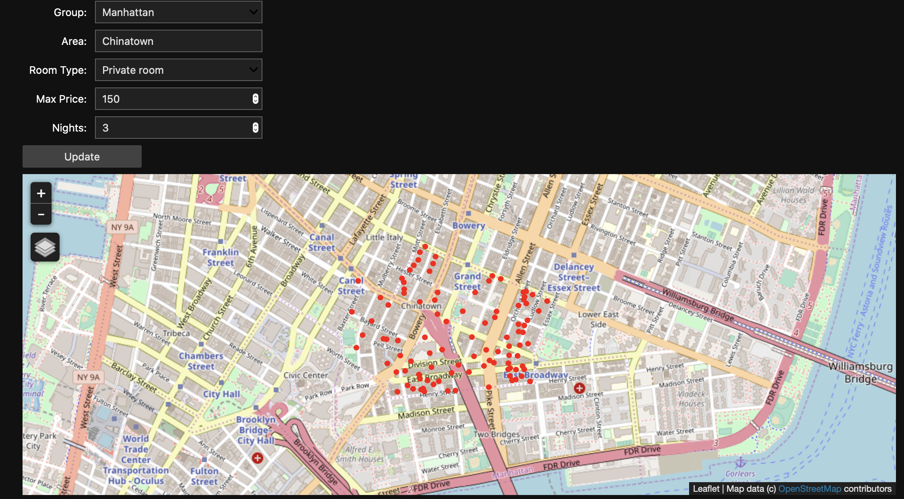
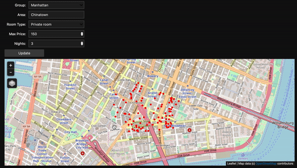

## New York Airbnb 2019 Visualization Tool

### Repo
 
[Github](https://github.com/phamminhquan/newyork_airbnb_2019)

### Description

With data taken from [Kaggle](https://www.kaggle.com/dgomonov/new-york-city-airbnb-open-data), I made a Jupyter Lab (or Jupyter Notebook) visualization tool. The tool takes in filter values such as:

* Group, i.e. neighbourhood, e.g. Brooklyn
* Area, e.g. Harlem
* Room type, e.g. Private room
* Maximum price (in dollars), e.g. 150
* Number of nights, e.g. 4

The map API will display a map zooming into the area specified and mark all the Airbnb listings that satisfies all the filter requirements.

### Dependencies

* ipyleaflet
* ipywidgets
* IPython.display
* csv

### Usage

* Run all `ny_airbnb.ipynb`
* Select filter requirements from widgets
* Click `Update` button

### Example
Here is an example of what the tool looks like:

Here is an example of how to select filter requirements:

### TODO
Implement some ML algorithm (maybe regression) to predict Airbnb price for next year
