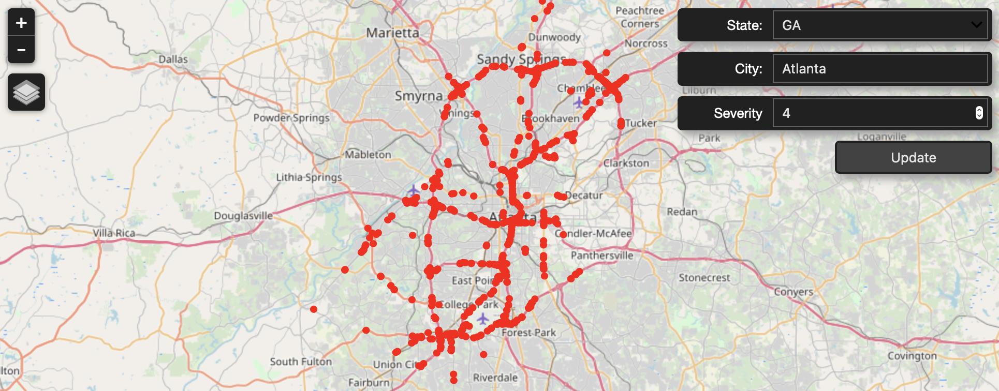
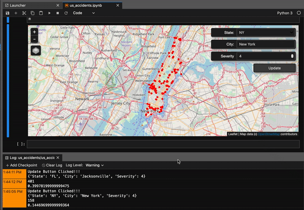

## US Accidents 2016-2019 filtered by state, city, and severity

### Repo

[Github](https://github.com/phamminhquan/filtered_us_accidents_2019)

### Description

Filter US Accidents from Febuary 2016 to March 2019 dataset by state, city, and severity and render a map of the city with all accidents marked. This can be used to analyze traffic safety patterns and controls.

### Dataset
US Accicents 2016-2019 dataset is pulled from [Kaggle](https://www.kaggle.com/sobhanmoosavi/us-accidents)

### Dependencies (currently)

* csv
* numpy
* ipyleaflet
* IPython.display
* ipywidgets

### Format

Jupyter Notebook

### How To Use

Open up `us_accident.ipynb`.

RUN ALL

You can change the location (i.e. state and city) and severity using the widgets on the map after you run the cell.

### Example of rendered map

Here's a map of Atlanta, GA, severity 4

### Example of changing location on map

### TODO:

* Efficient coding to reduce runtime
* Add exception handling
